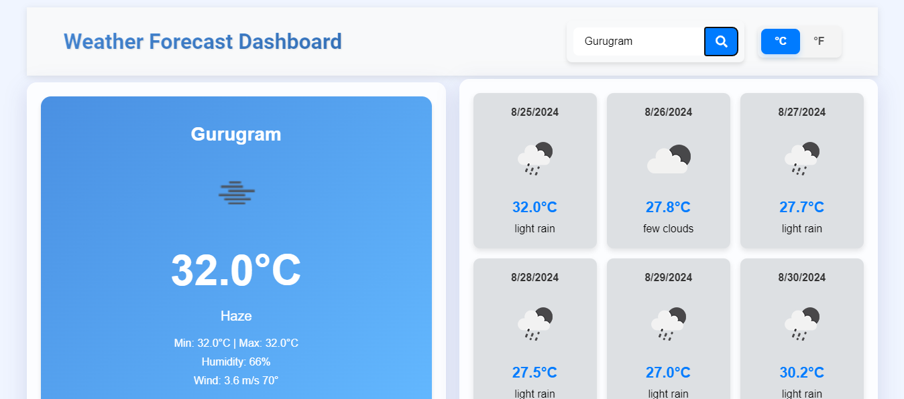

# Weather Forecast Dashboard



## Overview

The Weather Forecast Dashboard is a single-page application designed to provide users with current weather information and a 5-day forecast for any city. Utilizing the OpenWeatherMap API, this application enables users to easily check the weather conditions, including temperature, humidity, wind speed, and weather descriptions.

## Features

1. **Current Weather Details**: Users can enter a city name to view:
   - Current temperature
   - Minimum and maximum temperature
   - Humidity
   - Wind speed and direction
   - Weather description (e.g., clear sky, light rain)
   - An appropriate weather icon reflecting the current conditions

2. **5-Day Weather Forecast**: Displays a forecast for the selected city, including:
   - Date
   - Average temperature
   - Weather description
   - An appropriate weather icon

3. **Unit Conversion**: Users can toggle between Celsius and Fahrenheit for temperature readings.

4. **Error Handling**: The application provides clear feedback if the user enters an invalid city name or leaves the search input empty.

5. **Responsive Design**: The application is designed to look good on both desktop and mobile devices.

## Live Demo

You can view the live version of the application here: [Weather-forecast-dashboard](https://vivekkumar-wasserstoff-fullstack-intern-task3.vercel.app/).

## Technical Requirements

- Implemented using **HTML**, **CSS**, **JavaScript**, and **ReactJS**.
- The application is user-friendly and intuitive.
- The code is structured and maintainable, following best practices for development.

## Installation

To get started with the Weather Forecast Dashboard, follow these steps:

1. **Clone the repository**:
   ```bash
   git clone https://github.com/Vivek-018/Vivekkumar-wasserstoff-FullstackInternTask3.git
   cd weather-forecast-dashboard
   ```

2. **Install dependencies**:
   ```bash
   npm install
   ```

3. **Create a `.env` file**: In the root directory, create a `.env` file and add your OpenWeatherMap API key:
   ```plaintext
   VITE_API_KEY=your_api_key
   ```

4. **Run the development server**:
   ```bash
   npm run dev
   ```

5. Open your browser and navigate to `http://localhost:3000` or `http://localhost:5173` to view the application.

## Usage

1. Enter a city name in the search bar.
2. Click the search button or press Enter to fetch the weather data.
3. View the current weather and the 5-day forecast.
4. Use the toggle button to switch between Celsius and Fahrenheit.

## Acknowledgments

- [OpenWeatherMap](https://openweathermap.org/) for providing the weather API.


## Contact

For any inquiries or feedback, please contact me at [vr7064300@gmail.com](http://mail.google.com).
